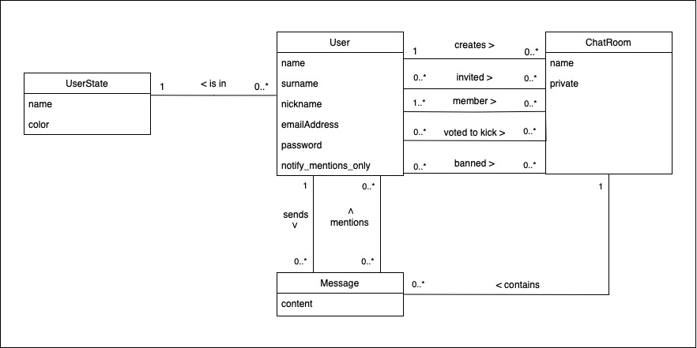

# VPWA_Chatterly_Bunca_Daniel

## Logický model databázy

Tento model popisuje vzťahy medzi používateľmi, chatovacími miestnosťami, správami a stavmi používateľov. 
Každý používateľ má základné atribúty ako meno, priezvisko, prezývku, e-mail, heslo a preferenciu týkajúcu sa upozornení len na zmienky. 
Používatelia môžu vytvárať chatovacie miestnosti, byť ich členmi, pozývať ďalších členov, hlasovať za vylúčenie iných používateľov alebo byť sami vylúčení. 
Každý používateľ je priradený k určitému stavu, napríklad „online“ alebo „offline“, a tieto stavy môžu byť vizuálne odlíšené farbou. 
Chatovacie miestnosti môžu byť verejné alebo súkromné, obsahujú množstvo správ a umožňujú rôzne interakcie medzi používateľmi.

